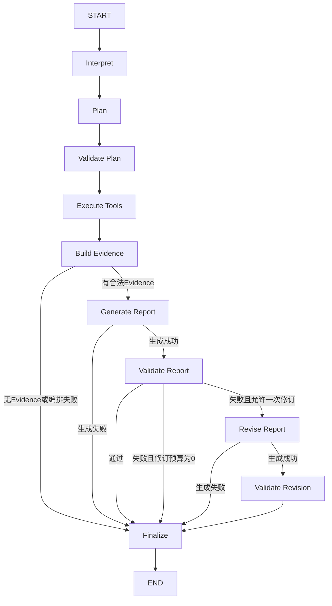

# Step 02 StateGraph正式设计

## 1. 本步结论

LangGraph负责研究Run的跨阶段状态、条件边、Checkpoint和终态收敛；第一阶段组件继续负责问题解释、受控计划、Tool输入校验、DAG执行、Evidence构造和报告校验。

迁移不改变金融数据语义，也不允许模型决定Graph边。默认运行时仍为`legacy`，只有显式设置`ORCHESTRATION_RUNTIME=langgraph`才启用新路径。

## 2. 节点与条件边



所有异常边由程序根据结构化状态选择。模型只生成符合`AnalysisPlan`的数据，不返回下一个节点名。

## 3. Graph State

Checkpoint只保存JSON安全的数据，不保存Provider客户端、数据库连接、Tool实例或异常对象。

| 分组 | 字段 |
|---|---|
| 标识 | `run_id`、`thread_id`、`question` |
| 编排 | `orchestration_stage`、`query_spec`、`plan`、`planner_source` |
| 数据 | `tool_results`、`evidence` |
| 报告 | `draft_report`、`final_report`、`validation`、`report_attempts` |
| 诊断 | `orchestration_timings`、`reporting_timings`、`errors`、`reporting_errors`、`node_trace` |
| 终态 | `reporting_status`、`terminal_writes` |

Pydantic模型写入State前使用`model_dump(mode="json")`，读取节点时重新执行`model_validate`。因此日期在Checkpoint中为ISO字符串，而外部API JSON语义与旧运行时一致。

## 4. 组件责任

| 责任 | 当前实现 |
|---|---|
| Graph状态与条件边 | LangGraph `StateGraph` |
| 当前Checkpoint | `InMemorySaver` |
| 问题解释 | `QueryInterpreter` |
| 计划生成与降级 | `StructuredPlanner` + `RulePlanner` |
| 计划和权限校验 | `PlanValidator` + `ToolRegistry` |
| Tool DAG、并发、Tool重试 | 既有`PlanExecutor` |
| Evidence边界 | `EvidenceBuilder` |
| 报告生成 | `EvidenceOnlyReporter` |
| 报告事实校验 | `ReportValidator` |
| API兼容 | `ResearchRunResult`和原`POST /analyze`Schema |

本步不将每个Tool再拆成LangGraph动态节点。否则同一步会同时重写DAG调度、依赖失败、并发限制和重试语义，无法判断差异来自状态迁移还是Tool调度迁移。Step 05建立Tool Gateway后，再评估按调用拆分持久化Task。

## 5. 终态规则

1. `Finalize`是所有路径的唯一终态写入节点；
2. `terminal_writes`必须从0变为1，重复写入直接报错；
3. 没有合法Evidence时，不调用Reporter；
4. 报告最多修订一次；
5. Tool部分失败但仍有合法Evidence时，可以生成带限制说明的报告；
6. Tool全部失败、计划非法或运行超时时，返回受控失败；
7. `Replan=0`，不因Tool失败让模型自由修改计划。

## 6. 运行时切换

```text
ORCHESTRATION_RUNTIME=legacy     # 默认，当前正式服务
ORCHESTRATION_RUNTIME=langgraph # Step 02预览
```

`research_factory.py`使用延迟导入：默认App不安装LangGraph也能启动。这样新框架的依赖不会在Gate 02前影响现有正式镜像。

## 7. Docker

- `app`：RAG依赖，默认`legacy`；
- `langgraph-spike`：核心依赖 + LangGraph，用于专项测试；
- `langgraph-app`：RAG依赖 + LangGraph，端口默认`8001`；
- RAG与Harness使用两个正交构建参数，使两个App复用PyTorch层；
- `langgraph-app`内存上限为1000 MB，仅比正式App增加100 MB。

预览命令：

```bash
docker compose --profile harness up --build langgraph-app
```

当前`InMemorySaver`只适合单进程预览；多实例、恢复和持久化进入Step 03。

## 8. 本步不实现

- PostgreSQL Checkpoint和业务Run表；
- Interrupt/Resume API；
- Skill Registry；
- Model/Tool Gateway与持久化幂等键；
- Session长期记忆与Context压缩；
- Job Worker和SSE；
- 动态Replan。
