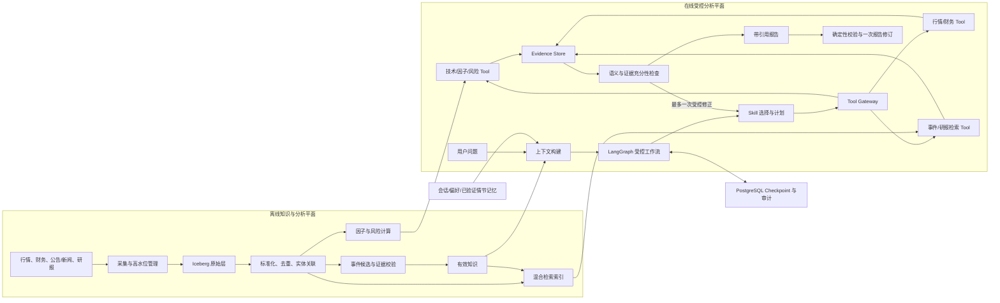

# 目标架构

## 1. 总体结构



## 2. 框架责任

| 组件 | 责任 | 不承担的责任 |
|---|---|---|
| LangChain | ChatModel、Structured Output、StructuredTool、Message、Retriever 标准接口 | 不直接决定金融权限和证据口径 |
| LangGraph | 状态节点、分支、Checkpoint、暂停/恢复、一次受控修正 | 不绕过 Gateway 直接访问数据 |
| Harness 增强层 | Policy、Budget、Gateway、Context、Memory、Evidence、Validator、Trace | 不替代模型完成语言理解和解释 |
| 确定性分析引擎 | 指标、因子、截面排名、风险向量和公式版本 | 不生成投资建议，不解释未知事实 |
| Skill Registry | 能力包发布、选择、Tool 可见性、流程和校验要求 | 模型不能自行发布或激活 Skill |

## 3. 数据放置

| 数据 | 存储 | 原因 |
|---|---|---|
| 原始行情、财务、文档和事件载荷 | Iceberg | 追加、版本化、可回溯和批处理友好 |
| 标准化行情、财务、因子与事件表 | Iceberg | 面向日线和中长期分析的统一数据湖表 |
| Run、Checkpoint、调用、知识状态、游标和记忆 | PostgreSQL | 事务、一致性、查询和生命周期管理 |
| 语义向量与检索字段 | Milvus，并配合关键词索引 | 面向混合检索，不作为事实源 |
| 原始 Evidence | 不可变证据存储/Run 产物 | 报告和压缩摘要都不能覆盖原始证据 |

项目可以称为“小型金融数据湖底座”：Iceberg 管理原始和整理后的表数据，支持版本化和统一读取；
但现阶段不是实时湖仓平台，也不应声称具备完整企业级湖仓治理。

## 4. 在线运行状态

建议在现有 `AgentState` 上新增或明确以下字段：

- `original_question`：不可变原问题；
- `resolved_time_expressions`：原表达、解析规则、起止日、完整周期约束；
- `query_spec` 与 `semantic_alignment_result`；
- `active_skill_versions` 与 `visible_tools`；
- `plan_version`、`replan_count`、`action_hashes`、`progress_marker`；
- `evidence_manifest` 与 `evidence_sufficiency_result`；
- `context_manifest`：来源、裁剪原因、Token 估算、压缩版本；
- `termination_reason`：成功、部分成功、预算、无进展、致命错误或取消；
- `report_validation_result` 和 `failure_reflection`。

## 5. 受控循环

```text
理解问题
  → 原问题与QuerySpec语义对齐
  → 选择Skill并生成计划
  → Gateway执行只读Tool
  → 汇总原始Evidence
  → 检查证据是否覆盖意图、实体、日期、指标和来源
      ├─ 充分：生成报告
      ├─ 可修复且replan_count=0：生成受限补充计划并再执行一次
      └─ 不可修复：输出部分结论、缺失项和限制
  → 校验数字、引用、量纲和结论支撑关系
  → 必要时仅修订一次报告
  → 保存终态与已验证反思
```

修正计划只能补齐缺失证据，不能改变原始目标，也不能新增未授权 Tool。每轮记录 Action Hash；
连续无新增证据或重复相同动作时立即终止，避免循环空转。

## 6. 模型和上下文策略

- Planner、解释、报告、报告修订和辅助 Reviewer 默认均使用 `deepseek-v4-flash`；
- 不按角色自动切换 Pro，不设置隐式模型回退；
- 同一模型可通过不同 Prompt 和隔离上下文承担 Maker/Checker 角色，但确定性校验优先；
- 为输出保留 20%～30% 上下文预算，输入预检后再调用模型；
- 固定系统指令、Tool Schema 和稳定说明的顺序，便于服务商前缀缓存；
- 大型证据通过 Manifest、父子引用和按需加载组织，压缩摘要不得替代原始证据；
- 用实际 API Usage 校准本地估算，不在客户端实现 KV Cache。

## 7. 安全和能力边界

- 所有 Tool 默认为只读；
- 模型不直接获得数据库连接、文件系统、网络请求或代码执行能力；
- 外部文档内容视为不可信输入，不能覆盖系统策略或扩大 Tool 权限；
- 事件知识必须经过来源、时间和实体校验后才能从 `CANDIDATE` 进入 `ACTIVE`；
- 报告必须区分事实、计算结果、模型解释和数据限制；
- 输出为研究辅助，不生成自动买卖动作。

